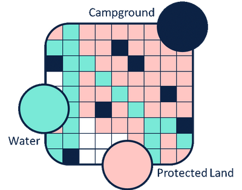

```{r setup, include=FALSE}
options(htmltools.dir.version = FALSE)
knitr::opts_chunk$set(
  echo = FALSE,
  fig.align = "center",
  message = FALSE,
  warning = FALSE
)
mapview::mapviewOptions(leafletWidth = 400, leafletHeight = 400)
```

```{r xaringan-themer, include=FALSE, warning=FALSE}
library(xaringanthemer)
extra_css <- list(
  ".title-slide h1" = list("color" = "#413c69", "font-size" = "4rem"),
  ".title-slide h2" = list("color" = "#c94281"),
  ".inverse h3" = list("color" = "#1687a7"),
  ".inverse h1" = list("color" = "#1687a7"),
  ".purple_h1" = list(
    "font-family" = "var(--header-font-family)",
    "color" = "#944db3",
    "font-size" = "4rem",
    "transform" = "rotate(-90deg)",
    "position" = "absolute",
    "top" = "30%"
  ),
  ".black_color" = list("color" = "#413c69"),
  ".pull-center" = list(
    "position" = "absolute",
    "top" = "10%",
    "color" = "#ff499e",
    "font-size" = "45px",
    "transform" = "rotate(-45deg)",
    "font-weight" = "bold"
  ),
  ".pull-top" = list(
    "position" = "absolute",
    "top" = "25%",
    "color" = "#af96d9"
  ),
  ".right-column2" = list(
    "width" = "55%",
    "height" = "92%",
    "float" = "right"
  ),
    ".left-column2" = list(
    "width" = "40%",
    "height" = "92%",
    "float" = "left"
  ),
  ".col-left" = list(
    "width" = "55%",
    "height" = "92%",
    "float" = "left"
  ),
  ".col-right" = list(
    "width" = "40%",
    "height" = "92%",
    "float" = "right"
  )
)


style_duo_accent(
  primary_color = "#b5f7de",
  secondary_color = "#FFFFFF", 
  white_color = "#dad9fc",
  inverse_header_color = "#944db3",
  text_bold_color = "#ff499e",
  link_color = "#bf4392",
  header_h1_font_size = "3rem",
  header_h2_font_size = "1.5rem", 
  header_color = "#944db3",
  title_slide_text_color = "#413c69",
  code_inline_color = "#48b59a", 
  text_slide_number_color = "#7c807f",
  header_font_google = google_font("Play", "400"),
  text_font_google   = google_font("Space Mono", "400"),
  code_font_google   = google_font("IBM Plex Mono"),
  extra_css = extra_css
)
```
background-image: url("img/cohete.png")
background-size: 400px 400px
background-position: center right

# Hoy hablaremos de:

- Introducción a R

- Conceptos básicos de datos espaciales

- Paquete sf

- Paquete raster

- Ejemplos prácticos

---
background-image: url("https://raw.githubusercontent.com/sporella/30daymap/master/plots/29_gfs.gif")
background-size: 400px 400px
background-position: center right
background-color: white


# Sobre mí

.col-right[


]

- Stephanie Orellana (sporella@uc.cl)

--

- Ingeniera Agrónoma y Magíster en Recursos Naturales

--

- No aprendí a programar en ningún curso de la Universidad, sino que por necesidad.

--

- Partí trabajando con modelos mixtos de variables climáticas, usando:
  + Arcgis
  + Excel
  + R

--

- Luego fui migrando completamente a R. Pero para "mirar" los rásters y vectores uso QGIS
  

---
class: middle
background-image: url("img/r.png")
background-position: center right


# Básicos de R

---
class: inverse
background-image: url("img/r-rstudio.png")
background-position: center right

# Básicos de R

.col-right[


]

--
- R es un lenguaje de **programación** y es un software libre

--
- RStudio es la **interfaz de usuario** más conocida (hace que R sea amigable e incluye herramientas para facilitar el trabajo)

--
- R es un lenguaje orientado a **objetos** en donde pueden aplicarse **funciones** a estos objetos.

---
class: middle
background-image: url("https://jules32.github.io/useR-2019-keynote/img/horst-welcome_to_rstats_twitter.png")
background-size: 600px 600px
background-position: bottom right
background-color: white
width: 50%

# Por qué usar R

.col-right[


]

- Es un software libre y gratuito

--
- Permite hacer investigación reproducible:

--
  - El flujo de trabajo queda escrito en código
  - Los análisis se hacen dentro del mismo programa

--
- Es una herramienta potente y está en constante desarrollo.

--
- Existe una gran comunidad alrededor del mundo que siempre está dispuesta a enseñar, responder preguntas y desarrollar nuevos paquetes.

--
  - Aprender a **buscar en Google** es primordial
  - **Twitter**

---
class: inverse
# R Base v/s Tidyverse

.pull-left[
```{r, out.width="50%"}
knitr::include_graphics("https://i.ytimg.com/vi/MCB4gNVfysU/maxresdefault.jpg")
```

- Programar con la sintaxis nativa de R
- Indices de objetos se realizan con: ` $ , [ ], [,] o [[]]`
- Funciones incluidas en el paquete base (base::)

]

--

.pull-right[
```{r, out.width="50%"}
knitr::include_graphics("https://miro.medium.com/max/4032/1*B-cwhqnFgGIbd9lWnzi_mQ.png")
```

- Grupo de paquetes diseñados para hacer ciencia de datos
- Busca una programación más intuitiva. Funciones como verbos.
- Todos los paquetes comparten una filosofía de diseño, gramática y estructuras de datos subyacentes.
- Operador "pipe" %>% 
]

---
class: inverse
# R Base v/s Tidyverse

```{r, eval=F, echo=T}
# Seleccionar columnas
## R base
iris$Sepal.Length
iris[, c("Petal.Length", "Sepal.Length", "Species")]

# Seleccionar columnas
## tidyverse
library(dplyr)

iris %>% 
  select(Petal.Length, Sepal.Length, Species)
```
--

.pull-top[
```{r, out.width="100%"}
knitr::include_graphics("https://image.slidesharecdn.com/emilytidyversepresentation-180205195912/95/the-lesser-known-stars-of-the-tidyverse-5-638.jpg?cb=1517860826")
```
]

--

.pull-center[

¡Para procesar datos espaciales necesitaremos las dos formas!

```{r, out.width="25%"}
knitr::include_graphics("https://cdn160.picsart.com/upscale-235481347027212.png?type=webp&to=min&r=1024")
```

]

---
class: middle left
background-image: url("img/spatial.png")
background-position: bottom right
background-size: 300px 300px

# ¡Vamos a la parte espacial!

---

# R vs SIG tradicionales

R | SIG Tradicionales
--------|---------|---------
Código ilimitado, se pueden mezclar diferentes paquetes para diferentes operaciones y análisis (incluso puedes hacer tus reportes y presentaciones en R). | Algunos como ArcGis y QGis tienen una consola de código en Python.
--

Visualización de datos espaciales no es tan detallada como en un SIG tradicional, aunque existen paquetes para explorar de forma dinámica. | Visualización rápida de grandes vectores y creación de estos con herramientas manuales especializadas.
--

---

# R vs SIG tradicionales

R | SIG Tradicionales
--------|---------|---------
Se puede hacer todo tipo de análisis y gráficos de la información espacial (ej: **`{ggplot2}`**). | Sólo vistas de mapas e histogramas.
--

Se pueden programar procesos iterativos para hacer la misma acción muchas veces (se puede programar todo). | Procesos en "batch" siguen siendo manuales.
--

Fácil análisis de las tablas de atributos (uso de tidyverse y contenidos del libro R for Data Science). | Análisis limitado de tablas de atributos.
--

Permite reproducibilidad, queda todo por escrito. | Poco reproducible, nada (o muy poco) queda por escrito.


---
# #Rspatial 

```{r embed, out.extra='style="border: none;"', out.width='90%'}
knitr::include_url('https://cran.r-project.org/web/views/Spatial.html')
```

---
class: inverse


```{r, out.width="90%", fig.align='center'}


```

[*] 50 paquetes más descargados con la etiqueta RSpatial desde 2015 

---
class: middle right
background-image: url("img/check-list.png")
background-position: bottom left
background-size: 300px 300px
title-size: 50%

# Conceptos básicos a tomar en cuenta


---
class: inverse
# 1. Tipo de dato/archivo

.pull-left[

.h2[VECTORES]

.p-caption[
```{r, out.width="55%", fig.cap="Fuente: <a href='http://katiejolly.io/rnorth-19'> @Katie Jolly </a>"}
knitr::include_graphics("img/vector.png")

```
]
]

.pull-right[
```{r, out.width="40%"}


```

- Mediciones de campo
- Estaciones meteorológicas
- Caminos
- Rutas GPS
- Comunas
- Regiones
- Áreas de estudio
]

---
class: inverse

# 1. Tipo de dato/archivo

.pull-left[
.h2[RÁSTER]
.p-caption[
```{r, out.width="62%", fig.cap="Fuente: <a href='http://katiejolly.io/rnorth-19'> @Katie Jolly </a>"}


```
]
]

.pull-right[
```{r, out.width="40%"}


```

- Imágenes satelitales
- Modelos climáticos
- Interpolaciones espaciales
- Imágenes aéreas
- Modelos de elevación digital
- Usos de suelo
- Datos (numéricos o categóricos) en grillas regulares
]

---
class: inverse
background-image: url("https://user-images.githubusercontent.com/520851/50280460-e35c1880-044c-11e9-9ed7-cc46754e49db.jpg")
background-position: bottom right
background-size: 550px 550px

# Vectores: paquete "sf"

.right-column2[


]

--
- Es el paquete "más moderno" para trabajar con vectores.

--
- Actúa bajo la lógica de **simple features** en donde un objeto espacial se divide en dos componentes:

--
  - data.frame (tabla de atributos)
  - geometría **geometry** (información espacial adherida)

--
- Es compatible con **tidyverse**

---
# Cargar datos con sf

```{r, eval=T, echo=T, out.width="50", out.height="30%"}
library(sf)

# Cargar datos
## Poligonos
espana <- read_sf("data/limites_espana.shp") #<<
head(espana)
```

---
# Cargar datos con sf

```{r, eval=T, echo=T, out.width="90", out.height="70%"}
## Puntos
aeropuertos <- read_sf("data/BCN500_0606P_AEROP_AEROD.shp") #<<
aeropuertos

```

---
class: inverse
# Rásters: paquete "raster"


.right-column2[
```{r, out.width="70%", fig.align='center'}
knitr::include_graphics("https://i.stack.imgur.com/xeqec.png")
```
]

--
- Es el paquete más utilizado para el procesamiento de rásters, aunque se está desarrollando el paquete `stars` (del mismo creador de `sf`) el cual permite el procesamiento de ráster en tidyverse

--
- El paquete ráster actúa bajo la lógica de una matriz de datos en donde el inicio se encuentra en el extremo superior izquierdo.

--
- Si sabes cómo procesar matrices con R Base, es fácil acceder a los valores de un ráster.

--
- El paquete tiene funciones para leer, transformar, analizar y guardar rásters.

---
# Cargar datos con raster


```{r, eval=T, echo=T, out.width = "90", out.height="30%"}
library(raster)

# Cargar datos
## Ráster individual
lst_01 <- raster("data/raster/lst_01.tif") #<<
lst_01
```


---
# Cargar datos con raster

```{r, eval=T, echo=T, out.width="90", out.height="30%"}
library(raster)

# Cargar datos
## Grupos de rásters

l <- list.files("data/raster/", full.names = T)
lst <- stack(l) #<<
lst
```

---
class: inverse
# 2. Proyección Espacial (CRS)


- Es fundamental conocer en qué proyección espacial se encuentran nuestros datos. Las proyecciones están determinadas por un CRS (coordinate reference system).

--

- Cada CRS puede estar definido por un EPSG (sigla de European Petroleum Survey Group) el cual es un código que se encuentra registrado en un listado de parámetros geodésicos (https://spatialreference.org/ref/)

--

- Si quiero hacer operaciones espaciales, todas las capas deben tener el mismo sistema de proyección.

--

- En Chile, los sistemas de proyección más usados son:
  - EPSG:4326: WGS 84
  - EPSG:32719: WGS 84 / UTM zone 19S
  - EPSG:3857: WGS84 Web (Pseudo)Mercator (Auxiliary Sphere)
  - EPSG:24879: PSAD56 / UTM zone 19S

---
class: inverse
# 2. Proyección espacial

```{r}
knitr::include_app("img/proj_face1.mp4")
```

[Andy Woodruff: Projection Face!](http://bl.ocks.org/awoodruff/9216081?utm_campaign)

---

# Cambiar proyección de un vector


```{r, eval=T, echo=T, results='hold', out.width="50"}
# Cambiar proyección
## Proyección actual 
st_crs(espana)$epsg
st_crs(espana)$proj4string
```

--

```{r, eval=T, echo=T, results='hold', out.width="50"}
## Cambiar a Pseudo Mercator
espana_psm <- st_transform(espana, crs = 3857) #<<
st_crs(espana_psm)$epsg
st_crs(espana_psm)$proj4string
```

---
# Cambiar proyección de un ráster


```{r, echo=T}
# Conocer CRS actual
crs(lst_01)
```

```{r, echo=T, results="hold"}
# Proyectar a UTM
lst_01_psm <- projectRaster(lst_01, crs = crs("+init=epsg:3857"))#<<
crs(lst_01_psm)

```

---
# 3. Extensión y resolución

--
- Muy importante cuando trabajo con rásters.

--
- Si mis rásters no tienen la misma extensión (bbox) espacial, no pueden tratarse como stacks. Tampoco si es que tienen diferente resolución

--

.pull-left[
```{r, echo=T}
extent(lst_01)
res(lst_01)
```
]

--
.pull-right[
```{r, echo=T}
extent(lst_01_psm)
res(lst_01_psm)
```
]

---
class:: middle
background-image: url("https://raw.githubusercontent.com/sporella/30daymap/master/plots/0_collage.png")
background-position: right

.purple_h1[
Visualización
]

---
# Cortar Vectores por atributos y visualizar

.pull-left[
```{r, eval=T, echo=T}
library(sf)
library(tidyverse)
# Seleccionar sólo Comunidad de Madrid
andalucia <- espana %>%
  filter(CCAA == "Andalucía")#<<

```

```{r, eval=F, echo=T}
## Gráfico rápido
plot(andalucia)
```
]

--
.pull-right[
```{r, results="asis", echo=F, fig.width=10, fig.height=4}
## Gráfico rápido
plot(andalucia)
```
]

---
# Vectores y ggplot2

.col-left[
```{r, eval=F, echo=T}
## Gráfico con ggplot
library(ggplot2)

ggplot(andalucia) +
  geom_sf(aes(fill = ETIQUETA))#<<

```
]

--

.col-right[
```{r, results="asis", echo=F, fig.width=10, fig.height=5, out.height="60%"}
## Gráfico con ggplot
library(ggplot2)

ggplot(andalucia) +
  geom_sf(aes(fill = ETIQUETA))#<<

```
]
---
# Cortar rásters por máscaras

.col-left[
```{r, echo=T, eval=T, out.width="50%"}
# Creo máscara
madrid_psm <- espana %>%
  filter(CCAA == "Comunidad de Madrid") %>%     
  st_transform(crs = 3857)

madrid_lst_01 <- mask(lst_01_psm, madrid_psm) #<<
plot(madrid_lst_01)
```
]

--
.col-right[
```{r, echo=T, out.width="70%"}
madrid_lst_01 <- crop(madrid_lst_01, madrid_psm) #<<
plot(madrid_lst_01)

```
]

---
# Rásters y ggplot2

.col-left[
```{r, echo=T, out.width="40%", eval = F}
# Convertir a tabla

rt <- data.frame(rasterToPoints(madrid_lst_01))

colores <- rev(terrain.colors(15))

ggplot() +
  geom_raster(data = rt, #<<
              aes(x = x, y = y, fill = lst_01)) +
  scale_fill_gradientn(colours = colores) +
  coord_equal()
```
]

.col-right[
```{r, echo=F, out.width="70%"}
# Convertir a tabla

rt <- data.frame(rasterToPoints(madrid_lst_01))

colores <- rev(terrain.colors(15))

ggplot() +
  geom_raster(data = rt , 
              aes(x = x, y = y, fill = lst_01)) +
  scale_fill_gradientn(colours = colores) +
  coord_equal()
```
]

---
# {mapview}

.pull-left[
```{r, echo = T, eval = T}
mapview::mapview(madrid_lst_01)

```
]

.pull-right[
```{r, echo = T, eval = T}
mapview::mapview(madrid_psm)
```
]

---
class: middle left
background-image: url("img/share.png")
background-position: right center
background-size: 450px 450px

# Recomendaciones

---
# Libros
.pull-left[
```{r, fig.cap=" <a href='https://geocompr.robinlovelace.net/'>Geocomputation with R</a>", out.width="50%"}
knitr::include_graphics("https://geocompr.robinlovelace.net/images/cover.png")
```
]

.pull-right[
```{r, fig.cap=" <a href='https://r4ds.had.co.nz/'>R for data science</a>", out.width="50%"}
knitr::include_graphics("https://d33wubrfki0l68.cloudfront.net/b88ef926a004b0fce72b2526b0b5c4413666a4cb/24a30/cover.png")
```
]

---
class: middle
background-color: white
background-image: url("img/twitter.png")
background-position: top right
background-size: 400px 400px

# A quién seguir


- https://twitter.com/CivicAngela  `#rspatialchat`

- https://twitter.com/Paula_Moraga_

- https://twitter.com/hadleywickham

- https://twitter.com/edzerpebesma

- https://twitter.com/RogerBivand

- https://twitter.com/jakub_nowosad

- https://twitter.com/robinlovelace

- `#rspatial`

- `#rstats`

---
class: inverse
background-color: white
background-image: url("https://image.freepik.com/vector-gratis/lego-isometrico_71884-8.jpg")
background-size: 300px 300px
background-position: bottom right

# Recomendaciones generales


--
- Si se demoró mucho en cargar, mejor no visualizar.

--

- Cuando se trabaja con datos muy grandes, mejor hacer todas las pruebas con una selección pequeña.

--

- R tampoco es mágico, si le damos las instrucciones incorrectas, no obtendremos el resultado esperado.

--

- R es rápido, pero hay procesos que se demoran. Esperar.

---
class: middle center
background-image: url("img/computer.png")
background-position: right center
background-size: 450px 450px

# Ejemplos


